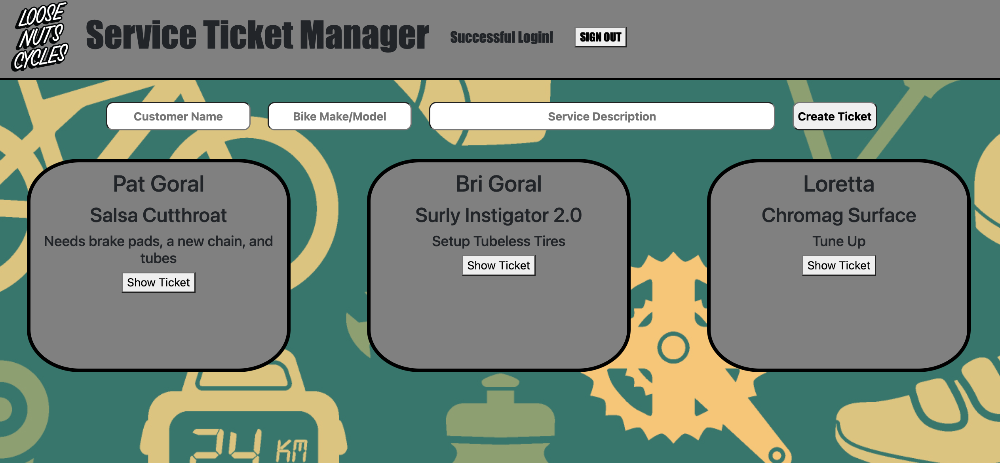
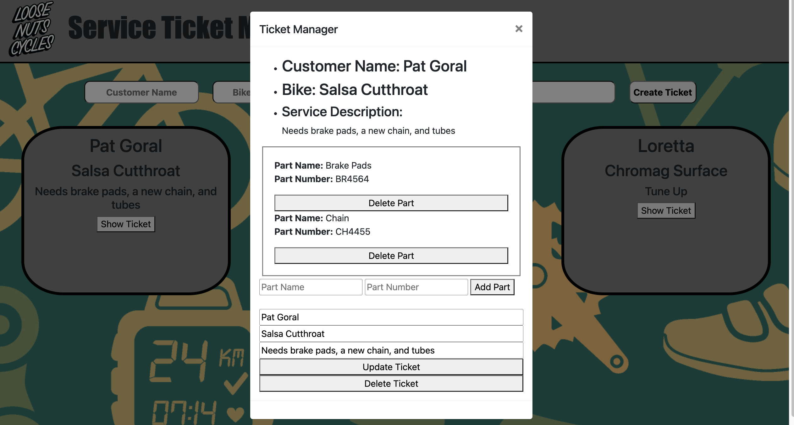

# Bike Shop Service Manager #

## Objective: ##

To create an app for bike shop employees to enter a ticket to keep track of upcoming service.
The employee will be able to login and create a ticket with customer and bike info, as well as a subdocument with parts and part numbers.

## Screenshots: ##
1. Sign in/Sign Up Screen

2. Main Screen after login:

3. Ticket editing modal screen: 

### Technologies Used: ###
-HTML
-JavaScript
-CSS
-Express
-Mongoose
-Json Web Token

## Entity Relationship Diagram (ERD): ##

## Getting Started: ##

You can visit the page at this link: (Bike Shop Service Manager)

## User Instructions: ##

-Each user will sign up with a unique username and password.

-The user will then sign in to access the main service ticket queue.

-Users will be able to see all service tickets created by all users.

-Users can then create a new ticket.

-Each user can only update or delete tickets that they created.

-Users can add/delete parts from any ticket whether they made it or not.

-Users can sign out, to return to the sign in screen.

## Next Steps ##

### Version Two: ###

-I plan to have error handlers if you try to edit/delete a ticke you didn't create.

-I plan to add a created by field, so that users can see who created each ticket.

-I plan to add a due date entry field to each ticket, and for the tickets to be ordered by soonest due date.

### Version Three: ###

-I would like to leverage an existing bike parts API to populate actual parts/part numbers as well as inventory counts.

-I would like to format for mobile